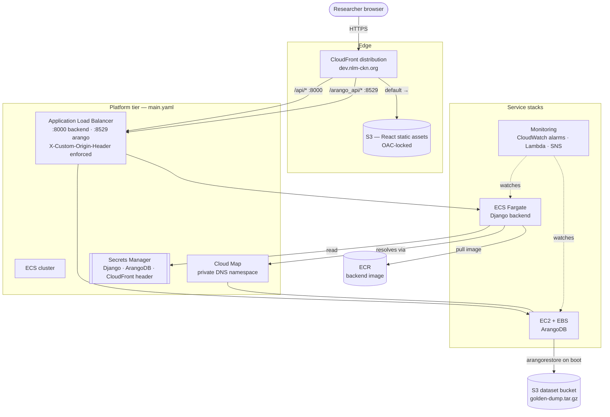

# Environment

Everything provisioned to run the NLM-CKN application. **`dev`** and **`stage`**
are owned end-to-end by this repo: they share a **platform tier** (secrets,
security groups, ECS cluster, Cloud Map, ALB) plus the **service stacks** that
run on top of it (frontend, backend, ArangoDB, monitoring), parameterized per
environment; parameter files live in [`parameters/`](parameters/).

The two NIH-account environments are handled outside this shared tier:

- **`sandbox`** has its own self-contained CloudFormation under
  [`sandbox/`](sandbox/) and is deployed separately (see
  [Sandbox](#sandbox-sandbox) below).
- **`prod`** infrastructure is managed by the NIH team outside this repo — no
  prod templates live here.

This is the running-application infrastructure. The ArangoDB **dataset** it
serves is produced separately by the [`etl/`](../etl/README.md) release
pipeline and restored onto the ArangoDB instance from the shared S3 dataset
bucket.

## AWS Architecture



The application is deployed to **https://dev.nlm-ckn.org/**. A researcher's
browser reaches **CloudFront**, which serves the React static assets from **S3**
(locked down with Origin Access Control) and routes `/api/*` and `/arango_api/*`
requests to the **Application Load Balancer**. CloudFront injects a secret
`X-Custom-Origin-Header` on those origin requests; the ALB listeners reject
anything without it (403), so the backend and ArangoDB cannot be reached
directly, bypassing CloudFront's TLS and caching.

Behind the ALB, the **Django backend** runs on **ECS Fargate** — it pulls its
image from the shared `nlm-ckn-backend` **ECR** repository, reads Django/ArangoDB
credentials from **Secrets Manager**, and resolves the database through the
**Cloud Map** private DNS namespace. **ArangoDB** runs on a single **EC2**
instance with an **EBS** volume and, on first boot / replacement, restores the
golden-dump dataset from the shared S3 dataset bucket via `arangorestore`.

> **Why EC2 for ArangoDB?** ArangoDB's RocksDB storage engine requires a local,
> POSIX-compliant filesystem. AWS EFS (NFS-based) is not supported and causes
> data corruption, so EC2 with an EBS volume is the only managed AWS option that
> satisfies this requirement — hence it sits outside the ECS cluster that runs
> the backend.

## Stacks

### Platform tier (`platform/`)

Deployed as nested stacks orchestrated by
[`platform/cloudformation/main.yaml`](platform/cloudformation/main.yaml), in
dependency order:

| Stack | Provisions |
|-------|------------|
| `secrets.yaml` | Random secrets for Django, ArangoDB, and the CloudFront origin header (stable across updates, never auto-rotated). |
| `security-groups.yaml` | ALB / backend / ArangoDB security groups. Created for **dev/stage** (the environments this repo owns end-to-end). |
| `ecs-cluster.yaml` | The ECS cluster the backend service runs in. |
| `service-discovery.yaml` | Cloud Map private DNS namespace for backend → ArangoDB resolution. |
| `alb.yaml` | ALB, ACM cert (shared by both HTTPS listeners and CloudFront), backend (`:8000`) and ArangoDB (`:8529`) target groups, and the origin-header enforcement rules. |

This tier is deployed only for **dev/stage**. The templates still carry an
`IsSelfManaged=false` path that reads IAM roles and security groups from SSM
prereqs (`/${ProjectName}/${Environment}/prereqs/*`) — a leftover from when this
repo also targeted the NIH accounts. That path is now unused: `sandbox` has its
own templates (below) and `prod` is managed by NIH outside this repo.

### Service stacks (`services/`)

| Service | Template | Provisions |
|---------|----------|------------|
| Frontend | `frontend/cloudformation/frontend.yaml` | S3 bucket, CloudFront distribution (S3 + two ALB origins), OAC, Route 53 record. |
| Backend | `backend/cloudformation/backend.yaml` | ECS task definition + service, IAM roles, auto-scaling policies. |
| ArangoDB | `arangodb/cloudformation/arangodb.yaml` | EC2 instance + EBS volume, Cloud Map service registration, S3 restore on boot. |
| Monitoring | `monitoring/cloudformation/monitoring.yaml` | CloudWatch alarms, wedge-detection Lambdas, SNS notifications, KMS key. Optional. |

### Sandbox (`sandbox/`)

The NIH `sandbox` account has constraints that the shared `platform/` +
`services/` templates can't satisfy, so its infrastructure is defined by
separate, self-contained CloudFormation under
[`sandbox/cloudformation/`](sandbox/cloudformation/) and deployed on its own
rather than through `platform/main.yaml`. It does **not** consume the platform
tier or the per-environment SSM prereqs described above.

## Deployment

Provisioned in **Wave 2** (platform tier, then the frontend/arangodb/backend
service stacks) with **monitoring** following in **Wave 3**:

```bash
./deploy/02-deploy-environment.sh <env>    # dev/stage: platform tier + frontend/arangodb/backend
./deploy/03-deploy-monitoring.sh <env>     # optional, needs the environment stack
```

The `sandbox/` stacks are deployed separately with their own CloudFormation, and
`prod` is deployed by the NIH team outside this repo — neither is driven by
`02-deploy-environment.sh`.

Application code and data are shipped onto this infrastructure separately from
the [`nlm-ckn-ui`](https://github.com/Springbok-LLC/nlm-ckn-ui) repo
(`deploy-backend.sh`, `deploy-frontend.sh`, `deploy-dataset.sh`). See the
[repo README](../README.md#deployment-order) for the full deployment order.
