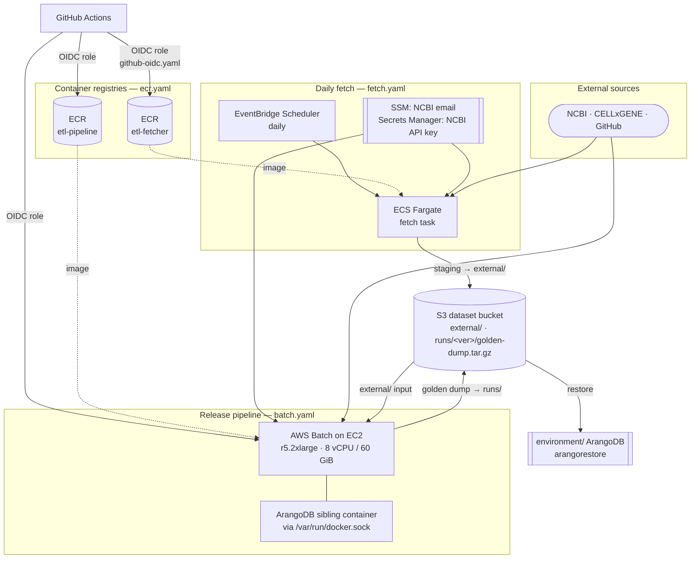

# ETL

Infrastructure for the NLM-CKN **data pipeline** (from
[`nlm-ckn-etl`](https://github.com/Springbok-LLC/nlm-ckn-etl)): the container
registries, the daily external-API **fetch** task, and the **release** compute
that runs the full ETL end-to-end and publishes the ArangoDB golden-dump
dataset.

This produces the dataset; the [`environment/`](../environment/README.md)
ArangoDB instance restores it from the shared S3 dataset bucket to serve the
running application.

## AWS Architecture



Two flows publish into one shared **S3 dataset bucket**:

- **Daily fetch** — an **EventBridge Scheduler** rule triggers an **ECS Fargate**
  task (the `etl-fetcher` image) once a day. It pulls from external APIs (NCBI,
  etc.) using credentials from **SSM** (`NCBI_EMAIL`) and **Secrets Manager**
  (`NCBI_API_KEY`), writes to an S3 *staging* prefix, then promotes atomically to
  the live `external/` prefix — so a concurrent pipeline run always sees a
  complete, consistent snapshot.

- **Release pipeline** — an **AWS Batch** job (the `etl-pipeline` image) runs
  `release.py` end-to-end: tarball extract, fetch, and the full ETL, taking
  ~8–12 h. It runs on **EC2** (not Fargate) because it mounts the host's
  `/var/run/docker.sock` to start **ArangoDB as a sibling container** during the
  build. The finished logical dump is written to S3 as
  `runs/<version>/06-golden-dump.tar.gz`, which the
  [`environment/`](../environment/README.md) ArangoDB instance later restores.

> **Why EC2 for the release job?** Fargate cannot mount `/var/run/docker.sock`,
> which `release.py` needs to start the ArangoDB sibling container via the Docker
> SDK. The job requests 8 vCPU / 60 GiB (leaving headroom on an r5.2xlarge) with
> a 24 h timeout ceiling.

## Stacks

| Template | Provisions |
|----------|------------|
| [`ecr.yaml`](cloudformation/ecr.yaml) | Two ECR repositories — `<project>-etl-pipeline` (Batch ETL job) and `<project>-etl-fetcher` (Fargate fetch task). Deploy once, then push images via CI/CD. |
| [`fetch.yaml`](cloudformation/fetch.yaml) | Scheduled Fargate fetch: ECS cluster + task definition, EventBridge Scheduler, NCBI SSM parameter + Secrets Manager secret, log group. |
| [`batch.yaml`](cloudformation/batch.yaml) | AWS Batch compute environment, job queue, and job definition for `release.py`, plus the EC2 launch template and IAM roles. Reuses the fetch stack's NCBI credentials. |
| [`github-oidc.yaml`](cloudformation/github-oidc.yaml) | IAM roles assumed by GitHub Actions via OIDC (no long-lived secrets) to push images and trigger the release job. Deployed manually, once per account. |

**Prerequisites** (shared, from [`shared/`](../shared/cloudformation/shared-resources.yaml)):
the ArangoDB dataset S3 bucket (mirrored to SSM, which `fetch.yaml` and
`batch.yaml` resolve at deploy time — do not pass a literal bucket name). The
release job also needs private subnets with a NAT gateway for outbound access to
GitHub, NCBI, CELLxGENE, and S3.

## Deployment

```bash
./deploy/02-deploy-fetch.sh    # Wave 2: ECR + fetch (after the images are pushed)
./deploy/03-deploy-batch.sh    # Wave 3: Batch release job (needs the fetch stack's outputs)
```

`github-oidc.yaml` has no deploy wrapper — deploy it by hand once per account
(see the command in the template header) and copy the role ARNs from its outputs
into the corresponding GitHub Actions repository secrets. See the
[repo README](../README.md#deployment-order) for the full deployment order.
